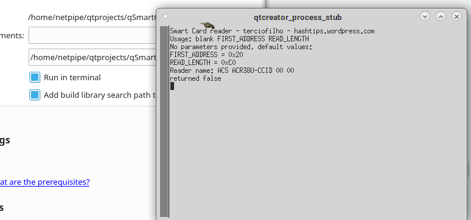

# qSmartCard
SmartCard Read/Writer application for writing bin files and executing scripts

WIP

would like to include hexeditor later

https://hackaday.com/2008/11/25/how-to-read-a-fedex-kinkos-smart-card-sle4442/#more-6059
http://dangerousprototypes.com/blog/2009/08/31/bus-pirate-sle4442-smart-card-update/

AT88SC102

